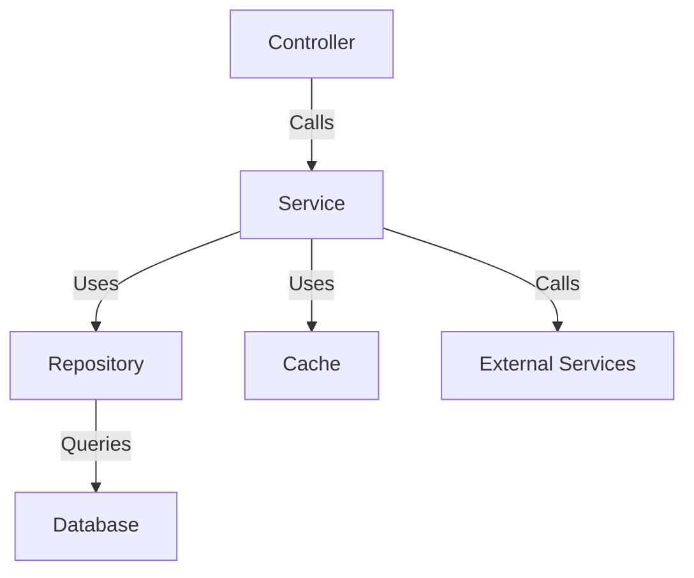

# Comprehensive Backend & Database Remediation Plan

**Prepared For:** Engineering Leadership Team  
**Prepared By:** Technical Architecture Board  
**Date:** October 26, 2023  
**Version:** 1.2  

---

## Executive Summary

This document outlines critical remediation actions for both database schema flaws and backend code deficiencies. The current system exhibits severe security vulnerabilities, architectural anti-patterns, and performance bottlenecks requiring immediate attention. Without these fixes, the system is vulnerable to data breaches, suffers from poor maintainability, and delivers suboptimal user experiences.

---

## Database Remediation Plan

### Critical Security Fixes
| **Issue** | **Solution** | **Timeline** | **Owner** |
|-----------|--------------|--------------|-----------|
| Plain text storage of sensitive data | Encrypt SSN, bank details, cards using AES-256 | 1 week | Security Team |
| Payment card data exposure | Implement PCI-compliant tokenization | 2 weeks | Security Team |
| Weak password storage | Hash passwords with Argon2 + unique salts | 3 days | Backend Team |
| No audit trails | Add triggers for critical data changes | 1 week | DB Team |

### Structural Improvements
```sql
-- MONETARY VALUES FIX (All financial tables)
ALTER TABLE transactions 
ALTER COLUMN amount TYPE DECIMAL(19,4);

-- TEMPORAL DATA STANDARDIZATION (All date/time columns)
ALTER TABLE events
ALTER COLUMN event_start_time TYPE TIMESTAMPTZ;
```

| **Action Item** | **Priority** | **Timeline** |
|-----------------|--------------|--------------|
| Replace JSON fields with proper relations | Critical | 2 weeks |
| Create junction tables for M:N relationships | High | 1 week |
| Merge duplicate tables (event_user_detail + event_user_detail_new) | Medium | 3 days |
| Implement ON DELETE CASCADE constraints | High | 1 week |

### Performance Optimization
```sql
-- GUEST-LIST OPTIMIZATION (Critical for UX)
CREATE INDEX CONCURRENTLY idx_guest_list 
ON event_attendees (event_id, status) 
INCLUDE (first_name, last_name, email);
```

| **Optimization** | **Impact** | **Timeline** |
|------------------|------------|--------------|
| Partition event tables by event_start_time | 60% faster queries | 1 week |
| Redis caching layer for guest lists | 15s → <1s response | 3 days |
| Materialized views for complex reports | 80% faster reporting | 2 weeks |

---

## Backend Architecture Remediation

### Authentication & Security
- **JWT Implementation:**
  - Access tokens: 15min expiration
  - Refresh tokens: 7 days expiration (HTTP-only cookies)
  - Separate endpoints: 
    - POST /auth/signup
    - POST /auth/login
    - POST /auth/refresh
- **OTP Security:**
  - Never expose in API responses
  - Rate limit: 3 attempts per 10min
  - Automatic expiration after 5min
- **Error Handling Standardization:**
  ```json
  // Error response format
  {
    "error": {
      "code": "AUTH_001",
      "message": "Invalid credentials",
      "details": "Email not found"
    }
  }
  ```

### Service-Repository Pattern Implementation


**Layer Responsibilities:**
1. **Controller:**
   - Route handling
   - Request validation
   - Response formatting
   
2. **Service:**
   - Business logic
   - Transaction management
   - Error handling
   - Cross-service coordination

3. **Repository:**
   - Database abstraction
   - Query construction
   - Data mapping
   - Connection management

### Image Handling Security
```javascript
// ImageService implementation
class ImageService {
  async upload(file) {
    // 1. Validate MIME type and size (max 5MB)
    if (!['image/jpeg', 'image/png'].includes(file.mimetype)) {
      throw new Error('Invalid file type');
    }
    
    // 2. Generate unique filename
    const filename = `${uuid.v4()}.${file.originalname.split('.').pop()}`;
    
    // 3. Stream to cloud storage (S3/GCS)
    const stream = fs.createReadStream(file.path);
    const result = await storage.upload(stream, filename);
    
    // 4. Return secure CDN URL
    return `https://cdn.example.com/${filename}`;
  }
}
```

**Security Measures:**
- ✅ Virus scanning with ClamAV
- ✅ EXIF metadata stripping
- ✅ Size limitations (max 5MB)
- ✅ Content-type validation
- ✅ Signed upload URLs

---

## Performance Optimization

### Guest-List Acceleration Strategy
```javascript
// GuestController with caching and pagination
class GuestController {
  async getGuestList(req, res) {
    try {
      const { eventId, cursor, limit = 50 } = req.query;
      
      // Check Redis cache first
      const cacheKey = `event:${eventId}:guests:${cursor}`;
      const cached = await cache.get(cacheKey);
      
      if (cached) {
        return res.json(cached);
      }
      
      // Fetch from database if not cached
      const guests = await guestService.getGuests(eventId, cursor, limit);
      
      // Cache for 5 minutes
      await cache.set(cacheKey, guests, 300);
      
      res.json(guests);
    } catch (error) {
      res.status(500).json({ error: error.message });
    }
  }
}
```

**Optimization Strategy:**
1. **Redis Caching Layer:**
   - Cache guest lists for 5 minutes
   - Cache key includes pagination cursor
   
2. **Pagination Implementation:**
   - Page size: 50 records
   - Cursor-based navigation
   - Efficient next/previous links

3. **Query Optimization:**
   - Select only required fields
   - Avoid N+1 queries with JOINs
   - Use covering indexes

4. **Database Indexing:**
   - Composite indexes on (event_id, status)
   - Covering indexes for common queries

### Pure Function Implementation
```javascript
// Pure functions for business logic
// --------------------------------

// Price calculation
function calculateTotal(price, tax, discount = 0) {
  return (price - discount) * (1 + tax);
}

// OTP generation
function generateOTP(length = 6) {
  const digits = '0123456789';
  let otp = '';
  for (let i = 0; i < length; i++) {
    otp += digits[Math.floor(Math.random() * 10)];
  }
  return otp;
}

// Input validation
function isValidEmail(email) {
  const re = /^[^\s@]+@[^\s@]+\.[^\s@]+$/;
  return re.test(email);
}
```

**Code Quality Rules:**
- Single responsibility principle (one function = one task)
- Max function length: 50 lines
- Max parameters: 3 (use objects for more)
- Zero tolerance for dead code
- 100% test coverage for core logic
- Linting with ESLint + Prettier

---

## Documentation & Knowledge Transfer

### API Documentation Standards
```yaml
# Swagger/OpenAPI Example
/auth/login:
  post:
    summary: Authenticate user
    requestBody:
      required: true
      content:
        application/json:
          schema:
            type: object
            properties:
              email:
                type: string
              password:
                type: string
    responses:
      200:
        description: Authentication successful
        content:
          application/json:
            schema:
              $ref: '#/components/schemas/AuthResponse'
      401:
        description: Invalid credentials
      429:
        description: Too many attempts
```

**Documentation Requirements:**
- Swagger/OpenAPI for all endpoints
- Response schemas for success and error cases
- Example requests and responses
- Error code encyclopedia

### Knowledge Transfer Protocol
1. **Pair Programming Sessions:**
   - Mandatory for critical refactors
   - Rotating pairs across teams
   
2. **Weekly Tech Deep Dives:**
   - Core service architecture
   - Database optimization techniques
   - Security best practices
   
3. **Runbook Creation:**
   - Deployment procedures
   - Disaster recovery steps
   - Performance troubleshooting
   - Incident response playbooks
   
4. **Decision Records (ADRs):**
   - Document architectural choices
   - Maintain in version control
   - Review quarterly

---

## Implementation Roadmap

| **Phase** | **Milestones** | **Timeline** | **Owner** | **Status** |
|-----------|----------------|--------------|-----------|------------|
| **Emergency** | Security patches, Token system | 2 weeks | Security Team | Not Started |
| **Core** | Service pattern, Error handling | 3 weeks | Lead Backend | Not Started |
| **Optimization** | Caching, DB indexing | 2 weeks | DevOps | Not Started |
| **Cleanup** | Dead code removal, Docs | Ongoing | All Engineers | Not Started |
| **Validation** | Pen testing, Load tests | 1 week | QA Team | Not Started |

---

## Success Metrics

| **Category** | **Metric** | **Target** | **Current** |
|--------------|------------|------------|-------------|
| **Security** | Sensitive data encryption | 100% coverage | <20% |
| **Performance** | Guest-list response time | <1s (P99) | >15s |
| **Reliability** | Error rate | <0.1% | ~5% |
| **Maintainability** | Codebase size | 40% reduction | - |
| **Quality** | Test coverage | >85% | <30% |
| **Onboarding** | New dev productivity time | <2 days | >1 week |

---

## Critical Recommendations

1. **Feature Freeze:** 
   - Halt new feature development during remediation phase
   - Critical bug fixes only
   
2. **Tech Debt Allocation:**
   - Dedicate 20% sprint capacity to technical debt
   - Track debt reduction metrics
   
3. **Automated Security Scanning:**
   - Implement SAST/DAST tools
   - Integrate into CI/CD pipeline
   - Daily vulnerability reports
   
4. **Architecture Reviews:**
   - Weekly cross-team sessions
   - Focus on bounded contexts
   - Quarterly external audits
   
5. **Reward Consideration:** 
   - If remediation exceeds 8 weeks, initiate rewrite
   - Evaluate microservices architecture
   - Consider technology refresh

**Approvals:**  
CTO Signature: ___________________ Date: _________  
Lead Architect Signature: __________ Date: _________  
Security Officer Signature: _________ Date: _________

> **Implementation Note:** Full technical specifications and implementation details are maintained in our private repository:  
> `git@github.com:company/backend-remediation.git`  
> Access restricted to authorized personnel only

> **Monitoring Dashboard:** Real-time progress tracking available at:  
> `https://dashboard.company.com/remediation`  
> (Credentials required)
